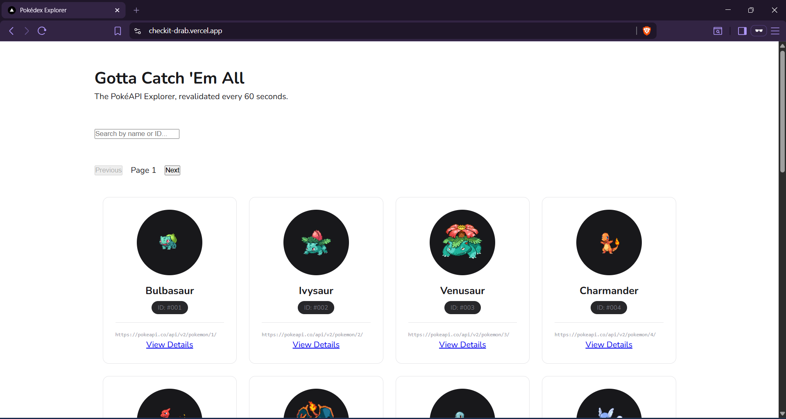
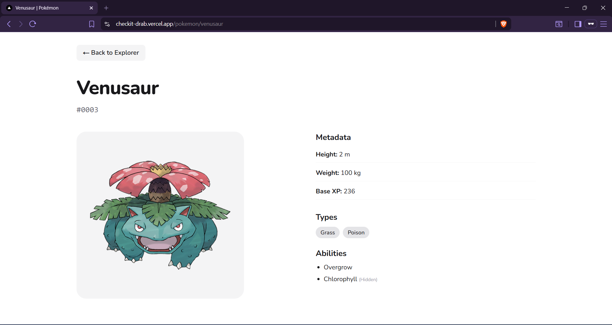
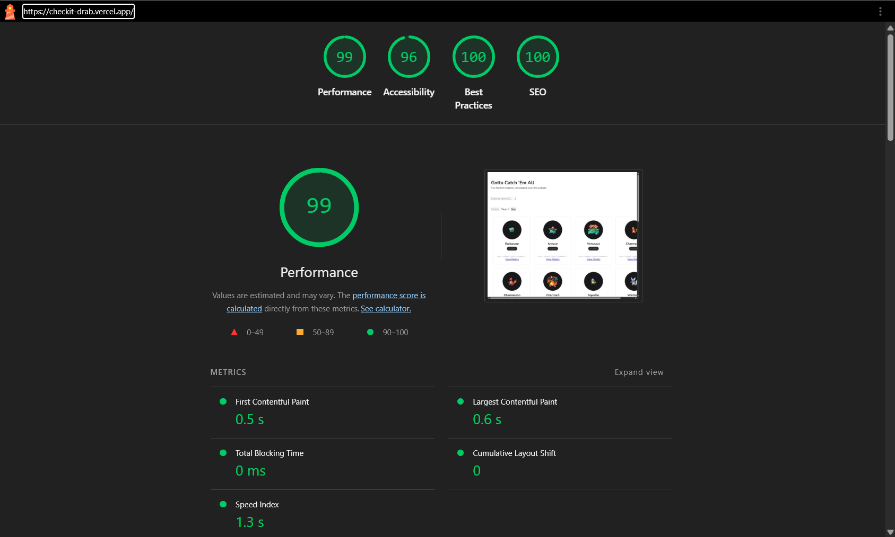
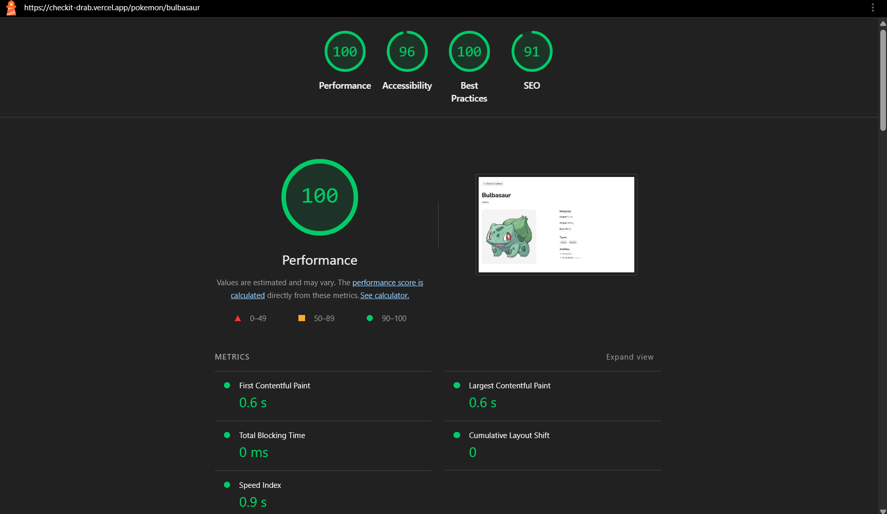

# PokéAPI Explorer

A production-ready Pokédex built with Next.js 14+ App Router, TypeScript, and TanStack Query.

🌐 **Live Demo:** [https://checkit-drab.vercel.app/](https://checkit-drab.vercel.app/)
📁 **GitHub:** [https://github.com/DevYoma/checkit](https://github.com/DevYoma/checkit)

---

## Getting Started (Project Setup)

First, run the development server:

```bash
npm run dev
```

Open [http://localhost:3000](http://localhost:3000) with your browser to see the result.

---

## Preview




---

## Lighthouse Score


---

## Key Features

- **Listing Page** — Server-side fetched Pokémon data, hydrated into React Query for client-side caching and updates.
- **Pagination** — URL-synced page state with smooth transitions using React Query.
- **Search** — Debounced, URL-driven search with conditional queries.
- **Detail Page** — Dynamic SSR page with SEO metadata and fast load times.

---

## Architecture & Technical Decisions

### 1. API Layer

I used my go-to **3-layer pattern**:

- **Service Layer** — pure API calls (`resource.service.ts`)
- **Hook Layer** — React Query (`useResource.ts`)
- **Component Layer** — consumes the hook

```ts
const { exposedHookData } = useResource()
```

I also made use of a **Query Key Factory** for cache consistency. I've seen codebases become really messy without a consistent way to track cache keys — especially when using React Query. Query keys ensure predictable invalidation and scaling.

> **Tradeoff:** Can be overkill for small apps, but you'll get to enjoy it when it clicks — it makes scaling much easier.

---

### 2. Home Page List

Used **Server Components** to fetch the initial Pokémon list and passed the data to the client via props. This is the common **hydration pattern** in Next.js — data on the server is taken over and controlled by data on the client.

**Benefit:** Helps with SEO and performance.

---

### 3. Reusable Component

Built a reusable `PokemonCard` component used in both the list and search result views.

---

### 4. Pagination

- Used **offset-based** pagination from the PokéAPI
- Used **nuqs** for URL-synced page state

---

### 5. Detail Page

Dynamic route `/pokemon/[name]` using a **Server Component**:

- Fetched data on the server side for SEO and fast initial load
- Generated dynamic SEO tags using `generateMetadata`

---

### 6. Search

- **Debounced input** (300ms) synced with the URL via nuqs
- Search calls the direct endpoint by name
- Limited to **exact match** due to PokéAPI constraints (no partial match support)

---

### 7. States (Loading, Error, Empty)

- Used `loading.tsx` and `error.tsx` for **route-level states**
- Used **React Query states** (`isLoading`, `isError`) for client-side updates

---

### 8. Performance Optimizations

- Used `next/image` for optimized images
- Applied **fetch caching strategies** (`revalidate: 60` for lists, `force-cache` for details)

---

### 9. Testing

- Used **Vitest** with **React Testing Library (RTL)**
- Tested `PokemonCard` UI rendering and `PokemonList` empty state

```bash
npm run test
```
